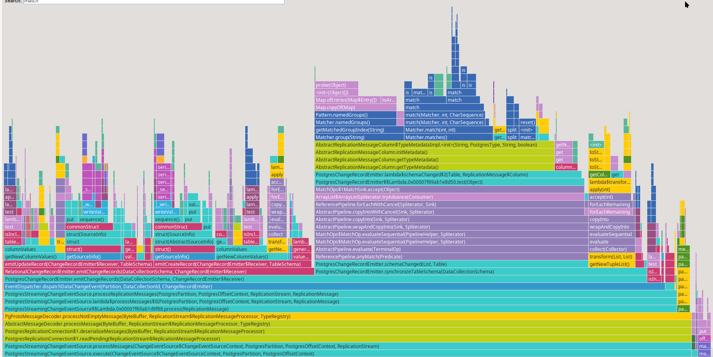
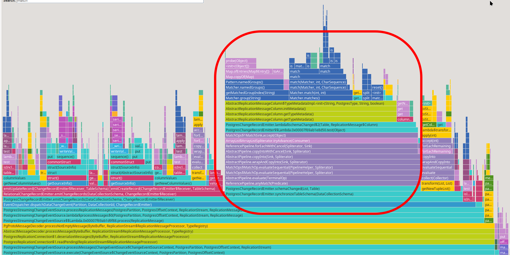
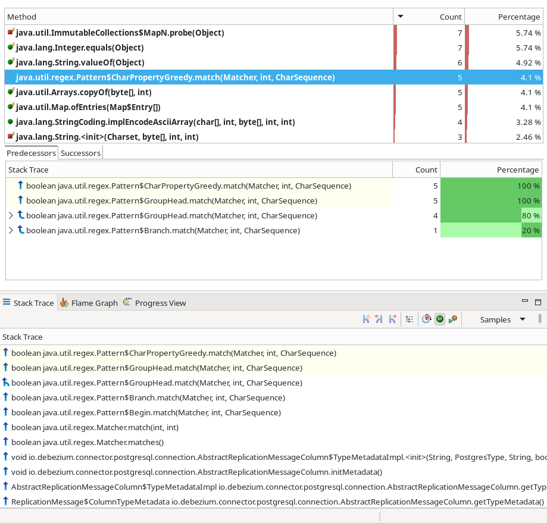
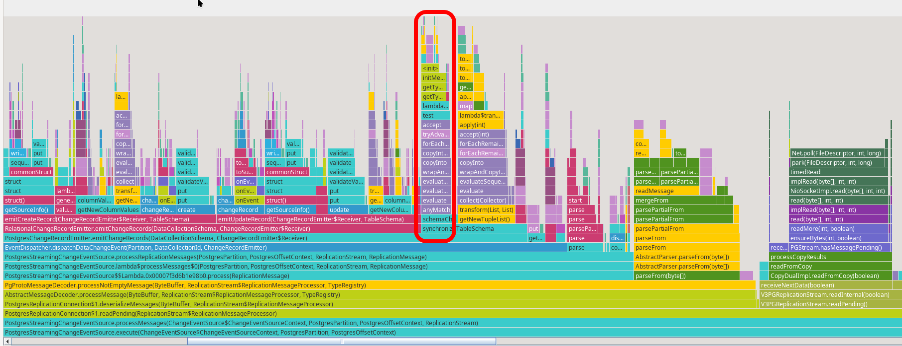

= Debezium Quick Performance Tests

The purpose of this document is to describe a quick way how to find and analyze one sort of possible performance issues in link:https://debezium.io/[Debezium].
It aims to describe the whole cycle, starting with setting up quick performance test, analyzing the results, proposing an improvement and checking the improvement impact.

Setting up proper performance test is usually pretty hard and includes many tricky points which can skew the results.
Approach here suggests a very quick way how to find possible bottlenecks.
These are usually  "low-hanging fruits" bottlenecks - those, which are obvious even with the simple setup.

This doesn't mean regular performance tests are not needed.
On the contrary.
Regular performance tests, especially end-to-end tests, are definitely still needed and many of the performance issues can be discovered only in a complex end-to-end setup, using advanced load generators etc.

[WARNING]
====
A lot of things here are simplified and can be misleading.
Don't just follow it blindly and don't take it as a source of truth.
====

== Test setup

=== Debezium application

Let's start with creating a simple application based on the Debezium embedded engine.
Example source code of such application can be found in link:https://github.com/vjuranek/debezium-quick-perf/tree/main/dbz-app[dbz-app] folder.
It uses embedded engine with Postgres connector.
It basically does no configuration and use the default values, which means that is uses `decodebufs` plugin to retrieve data from the Postgres database (this will be relevant later on).
Application does nothing with the obtained data to avoid the situation when the application would spend most on the time in record post-processing, e.g. in single message transformation.

You can build the application using Maven as usual:

```
mvn clean package -f dbz-app/pom.xml
```

As the Debezium offset will be stored on the disk in the `data` directory, we need to create this folder before we run the application:

```
mkdir data
```

=== Postgres

As we selected Postgres connector for this example, we need to setup test Postgres database.
We can leverage container image provided by Debezium project, as it provides all the needed database configuration out of the box:

```
podman run --rm --name postgres -it -e POSTGRES_PASSWORD=postgres -p 5432:5432 quay.io/debezium/example-postgres:3.2
```

We also need a tool which would generate some load on the database during the test.
Postgres provides such tool directly with the database, called  link:https://www.postgresql.org/docs/current/pgbench.html[pgbench].
On Linux distributions it's usually shipped in a different package than the database itself.
E.g. on Fedora you need to install `postgresql-contrib` package.

[WARNING]
====
As mentioned earlier, one of the important task when setting up regular performance test is selection of the load generator.
The generator may suffer from link:https://redhatperf.github.io/post/coordinated-omission/[coordinated data omission], generate unrealistic data etc.
All these issues may eventually lead to completely misleading data.
As mentioned at the beginning, we are not going to solve these issues here and this is only one of the steps where we heavily simplify the things (with all the consequences).
====

To be able to use `pgbench`, we need to create test tables which it will use:

```
PGPASSWORD=postgres pgbench -h 127.0.0.1 -U postgres -i postgres --scale=10
```

It will create couple of `pgbench_*` tables in the database and as you may noticed, our application is already configured to capture these `pgbench_*` tables.

== Running the test

Now, when everything is ready, let's generate some load on the DB using `pgbench`:

```
PGPASSWORD=postgres pgbench -h 127.0.0.1 -U postgres --scale=10 -b simple-update --jobs=20 --client=20 -T 120 postgres
```

and at the same time run `dbz-app` with Flight Recorder enabled:

```
java -XX:+FlightRecorder -XX:StartFlightRecording=delay=30s,duration=60s,filename=dbz-flight.jfr,settings=profile -jar dbz-app/target/debezium-quick-perf-1.0-SNAPSHOT.jar
```

To be able to record flight recording, you have to add `-XX:+FlightRecorder` option when you start the application.
Then you can either do the recording manually from the tool you are using or add another option which specifies how long the recording should take, where it should be stored and if there should be any initial delay: `-XX:StartFlightRecording=delay=30s,duration=60s,filename=dbz-flight.jfr,settings=profile`.

Once the flight recording is done, you can stop the application and `pgbench` if it still runs.
The database can be stopped as well and container can be removed.

If you want to repeat the recording, it's good to start with clean database and also delete the offset in the `data` directory.

== Analyzing the results

Once we have flight recording, we can open it in a tool which supports it.
It can be directly your IDE, but I'm used to do it in a dedicated tool, namely in link:https://jdk.java.net/jmc/[Java Mission Control].
The only issue on with this tool is insufficient support for link:https://wayland.freedesktop.org/[Wayland].
As a result you may not be able to see flame graph view, or better to say, it will be empty.
See link:https://bugs.openjdk.org/browse/JMC-8247[JMC-8247] for more details.
I mention it here specifically as I took me quite some time to figure out that it's actually a bug in JMC.
The workaround is to use X11->Wayland bridge.


The flame graph gives us quick overview of the whole run:



One thing which stands out at the first glance is the large part consumed by `schemaChanged()` method and subsequent matching of regular expression:



You can conclude the similar result when you check  `Method profiling` view:



Regular expression matching is one of the hottest methods.
In the same view you can also check the stack trace of the sample being profiled, so you can see where it exactly comes from.


Here the issue is that Postgres doesn't send any schema change events and the schema change information is send together with with the first record using the changed schema.
Thus Debezium has to check for possible schema changes in almost every single record it's processing.
How it's exactly done depends on the plugin being used, for default `decodebufs` it's done by comparing record type and other modifiers with info Debezium already has.
Type modifiers are provided as `String` by the pluing and are parsed by Debezium using regular expression.
As it's done for almost every message, it piles up.

As we found possible bottleneck in the code, it's always good to share the findings with the developers and file a bug for our findings.
For this one, I created link:https://issues.redhat.com/browse/DBZ-9093[DBZ-9093].

== Proposing fix

In previous step we identified an issue in Postgres connector when `decodebufs` plugin is used.
Fortunately `pgoutput` hasn't this issue, but as Debezium still supports `decodebufs` and it's even the default one, so let's try to fix it.


=== JMH benchmark

To have some measure how we improve the throughput with our fix, we can use link:https://github.com/openjdk/jmh[Java Microbenchmark Harness] tool, which was developed exactly for this purpose.
You can find very simple JMH benchmark in link:https://github.com/vjuranek/debezium-quick-perf/tree/main/jmh-postgres[jmh-postgres] directory.
Again, JMH benchmark and all the microbenchmarking  approach has many possible pitfalls and the benchmark mentioned here simplifies the things, but it gives us at least some base line.

On my machine I got following results:

```
Iteration   1: 0.768 us/op
Iteration   2: 0.761 us/op
Iteration   3: 0.780 us/op
Iteration   4: 0.780 us/op
Iteration   5: 0.750 us/op

Benchmark                                Mode  Cnt  Score   Error  Units
PostgresTypeMetadataPerf.columnMetadata  avgt    5  0.768 ? 0.049  us/op

```

Once we have a base line, we can start thinking about the fix.
As the type modifiers are same most of the time, probably the most easy way how to fix the issue is to cache them in a map.
We can verify the fix by re-running JMH benchmark.

The patched version gave me these numbers:

```
Iteration   1: 0.278 us/op
Iteration   2: 0.278 us/op
Iteration   3: 0.284 us/op
Iteration   4: 0.288 us/op
Iteration   5: 0.291 us/op

Benchmark                                Mode  Cnt  Score   Error  Units
PostgresTypeMetadataPerf.columnMetadata  avgt    5  0.284 ? 0.023  us/op
```

We can argue that the benchmark is very simple and there are possibly few other issues, but as the improvement is quite significant, we can believe this will improve the throughput little bit also in the reality.

As the final test we can re-run out simple performance test and check how big part is now consumed by the `schemaChanged()` method.
If you only visually check the flame graph, you can see obvious improvement:



Once we are done, just send a link:https://github.com/debezium/debezium/pull/6467[pull request], which can in ideal case include also JMH benchmark which was used for testing the patch.

To have higher confidence in the fix, we would need proper end-to-end performance pipeline though.
However, in end-to-end performance test the effect of such fix will be small, maybe even negligible.
In JMH test and also in our test application we don't do any serialization, which takes lots of time and overall simplify things.
So what may look like a big improvement in this simple test may be only a small improvement in the reality.

== Conclusion

I tired to show a simple and quick way how to identify at least some of the bottlenecks.
I also tried to point out that this approach has many possible pitfall and briefly mentioned some of them.
However, this approach can be useful for developers to run simple benchmarks directly on their machines, allowing them to spot and fix some bottlenecks in the code.
Once the developer identifies the issues, and possibly has also a patch for it, it should be tested with properly setup performance benchmarks developed for the product.
